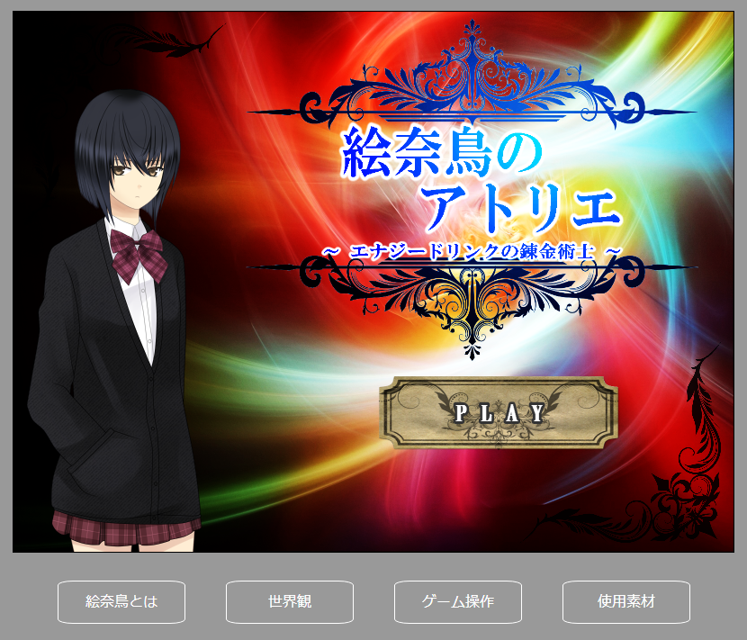

# atelier

---

素材集めゲーム。  
素材を集めて成果物を錬成し、内定をもらうとクリアです。  
詳細は下記公開ページ内の「ゲーム操作」を参照してください。

## 公開ページ
[公開ページ](http://disconeko.github.io/atelier/)

## 動作等
・音が出ます。  
・Vista以降推奨。（Macでは動作確認をしていません。）  
・読み込みが遅い時はリロードしてください。  
・Chrome等のHTML5に対応したブラウザを使ってください。  
・Officeの入っていないＰＣ環境では、フォントの都合でレイアウトが崩れることがあります。  
